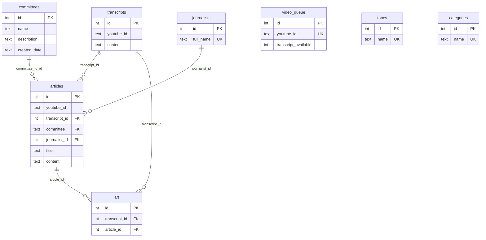
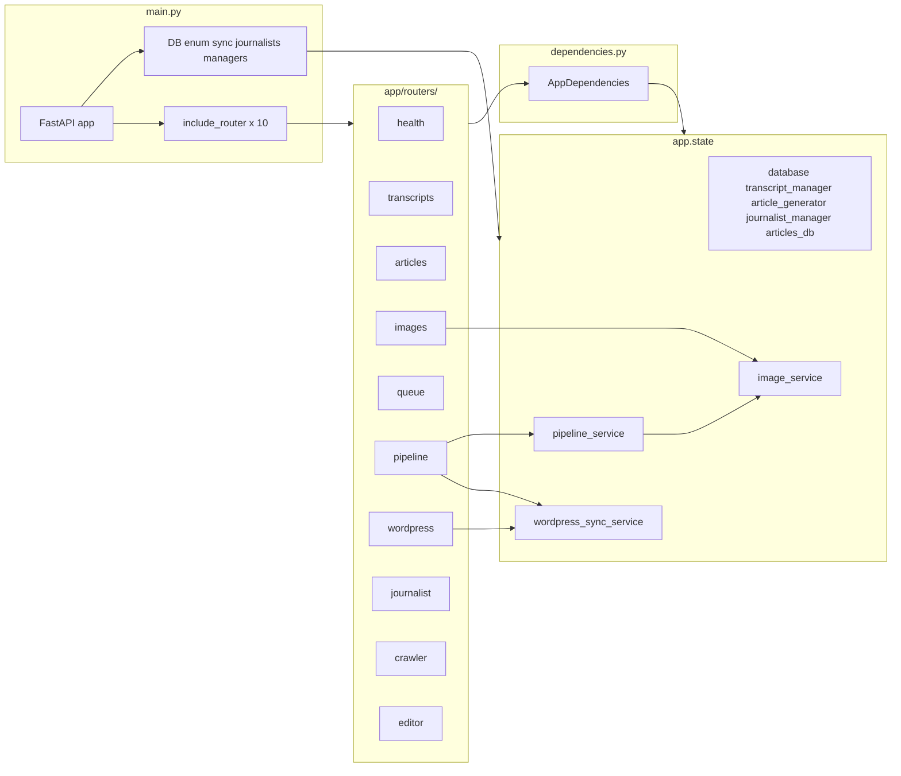

# FastAPI, Docker, and WordPress dev environment for The Fall River Mirror

**License:** This project is licensed under the [Polyform Noncommercial 1.0.0](https://polyformproject.org/licenses/noncommercial/1.0.0) license. Noncommercial use is free; commercial use is prohibited without permission. See [LICENSE](LICENSE) for full terms.

## Table of contents

- [Overview](#overview)
- [Getting started](#getting-started)
  - [Required credential files](#required-credential-files)
  - [Building Docker images](#building-docker-images)
  - [Running the environment](#running-the-environment)
  - [Refresh Python dependencies in profile-based Docker setups](#refresh-python-dependencies-in-profile-based-docker-setups)
- [Development vs production mode](#development-vs-production-mode)
  - [Goal](#goal)
  - [Two modes](#two-modes)
  - [Env / config](#env--config)
  - [Docker Compose](#docker-compose)
  - [Usage summary](#usage-summary)
- [Features](#features)
- [API endpoints](#api-endpoints)
- [API documentation](#api-documentation)
- [Database](#database)
  - [Transcript caching](#transcript-caching)
- [What can delete articles or transcripts](#what-can-delete-articles-or-transcripts)
  - [Articles](#articles)
  - [Transcripts](#transcripts)
  - [Schema](#schema)
  - [If both articles and transcripts dropped together](#if-both-articles-and-transcripts-dropped-together)
  - [How to check after the fact](#how-to-check-after-the-fact)
- [Application architecture](#application-architecture)
- [AI creator architecture](#ai-creator-architecture)
- [Project structure](#project-structure)
- [Development](#development)
- [Helpful tips](#helpful-tips)
- [Troubleshooting](#troubleshooting)

## Overview

This project provides a development environment for The Fall River Mirror with:

- **FastAPI backend**: Python API with AI-powered article generation
- **WordPress frontend**: Content management system
- **Docker environment**: Profile-based Compose (`dev` vs `prod`) — see [Development vs production mode](#development-vs-production-mode)
- **Transcript caching**: Intelligent YouTube transcript storage and retrieval
- **CRUD operations**: Full create, read, update, delete API for articles

## Getting started

Change the name of the file `.env.sample` to `.env` and adjust the values accordingly.

### Required credential files

You will need to create the following three credential files in the project root directory. These files are not included in the repository for security reasons:

1. **`client_secret.json`** — Google OAuth credentials file
   - Contains your Google OAuth client ID, client secret, and project configuration
   - Get this from [Google Cloud Console](https://console.cloud.google.com/apis/credentials)
   - Format: Standard Google OAuth credentials JSON file

2. **`youtube_token.json`** — YouTube API OAuth token
   - Contains your YouTube API access token and refresh token
   - Generated during the OAuth authentication flow
   - Format: JSON file with token, refresh_token, client_id, client_secret, and scopes

3. **`youtube_cookies.txt`** — YouTube session cookies
   - Contains browser cookies for YouTube authentication
   - Used for accessing YouTube content that requires authentication
   - Format: Netscape cookie file format

**Note:** These files are already listed in `.gitignore` and will not be committed to the repository. You must obtain the contents for these files yourself through the appropriate Google Cloud Console and OAuth setup processes.

In order to run this project, you will need to create two images with Docker.

### Building Docker images

The first one is the WordPress image. To build, use the following command:

```bash
docker build -t fr-mirror .
```

The second image you need to create is for the Python API. To build this one, enter the following command:

```bash
docker build -f Dockerfile.ai -t fr-mirror-ai .
```

### Running the environment

Now you are ready to create the environment. The sites will be available at localhost on the ports in your `.env` file.

Use the same [`docker-compose.yml`](docker-compose.yml) with Compose **profiles** — pass `--profile dev` or `--profile prod` so Compose starts the right services (see [Development vs production mode](#development-vs-production-mode) for detail).

- **Development (full stack):** `docker compose --profile dev up` — WordPress, MySQL, mirror-ai, Typesense, Caddy, etc. Use `.env`; set `WORDPRESS_BASE_URL` to your local WordPress (e.g. `http://wordpress:80` or `http://localhost:9004`).
- **Production:** `docker compose --profile prod up` — mirror-ai plus prod-oriented services (e.g. Typesense, Caddy); no local WordPress/MySQL. Load production overrides via `.env.prod` (e.g. `WORDPRESS_BASE_URL=https://fallrivermirror.com`).

### Refresh Python dependencies in profile-based Docker setups

If YouTube downloads start failing while transcript lookups still work, `yt-dlp` may be out of date in the running container. Rebuild the AI image for the active profile so dependencies from `requirements.txt` are reinstalled. Service names match [`docker-compose.yml`](docker-compose.yml) (e.g. `fr-mirror-ai`).

**Dev profile**

```bash
docker compose --profile dev build --no-cache fr-mirror-ai
docker compose --profile dev up -d fr-mirror-ai
docker compose --profile dev exec fr-mirror-ai python -m yt_dlp --version
```

**Prod profile**

```bash
docker compose --profile prod build --no-cache fr-mirror-ai
docker compose --profile prod up -d fr-mirror-ai
docker compose --profile prod exec fr-mirror-ai python -m yt_dlp --version
```

Notes:

- Use `--no-cache` when you suspect stale dependency layers.
- If your queue worker is a different service, replace `fr-mirror-ai` with that service name.
- `yt-dlp` is installed through `requirements.txt` during `Dockerfile.ai` image build.

## Development vs production mode

How the system is set up after the prod-only compose change.

### Goal

- **Development**: Full local stack — WordPress + MySQL + mirror-ai (FastAPI). FastAPI talks to local WordPress. Use local URLs in `.env`.
- **Production**: mirror-ai (FastAPI) plus prod support services (e.g. Typesense, Caddy); no local WordPress or MySQL. FastAPI talks to the live WordPress instance at fallrivermirror.com. Use production values in `.env.prod`.

### Two modes

| Aspect | Development | Production |
|--------|-------------|------------|
| **What runs** | mirror-ai + db + wordpress + my-wpcli + phpmyadmin (+ shared e.g. Typesense) | mirror-ai + Typesense + Caddy (no WordPress/MySQL) |
| **WordPress** | Local container (same compose network) | Not started; use live site |
| **MySQL** | Local container | Not started |
| **How to start** | `docker compose --profile dev up` (or `... down`) | `docker compose --profile prod up` (or `... down`) |
| **Env file** | `.env` (local values, e.g. `WORDPRESS_BASE_URL` to local IP or `http://wordpress:80`) | `.env.prod` (production values; `WORDPRESS_BASE_URL=https://fallrivermirror.com`) |

### Env / config

- **`.env`** — used by both modes. Contains all variables for the full stack and mirror-ai (API keys, DB, ports, etc.). For dev, set `WORDPRESS_BASE_URL` to your local WordPress (e.g. `http://wordpress:80` or `http://localhost:9004`).
- **`.env.prod`** — loaded by prod-profile services in [`docker-compose.yml`](docker-compose.yml) *after* `.env` so it overrides. Contains only the values that differ in production; at minimum `WORDPRESS_BASE_URL=https://fallrivermirror.com`.

Both modes use the same [`docker-compose.yml`](docker-compose.yml); pass `--profile dev` or `--profile prod` so Compose starts the right services.

### Docker Compose

- **Development**: [`docker-compose.yml`](docker-compose.yml) with `--profile dev` starts the full stack (WordPress, MySQL, dev tooling, mirror-ai, shared services such as Typesense). Dev mirror-ai may use additional env files as declared in compose (see `env_file` on each service).
- **Production**: Same file with `--profile prod` starts prod-oriented services (mirror-ai, Caddy, Typesense, etc.) and uses layered env files on those services so `.env.prod` overrides (e.g. `WORDPRESS_BASE_URL`).

### Usage summary

- **Dev:** `docker compose --profile dev up` or `docker compose --profile dev down` (from the directory containing `docker-compose.yml` and `.env`).
- **Prod:** `docker compose --profile prod up` or `docker compose --profile prod down` (same directory; keep `.env.prod` with production values, including `WORDPRESS_BASE_URL=https://fallrivermirror.com`).

## Features

### AI-powered article generation

- Generate articles using AI processing
- Support for different article types (Summary, Opinion/Editorial)
- Multiple writing tones (Friendly, Professional, Casual, Formal)
- Committee-specific content generation

### YouTube transcript integration

- **Intelligent caching**: Automatically stores transcripts in database
- **Fast retrieval**: Cached transcripts load 10–100x faster
- **Automatic storage**: New transcripts are automatically saved for future use
- **Database integration**: SQLite storage with full transcript management

### Full CRUD API

- **Create**: Generate new articles with AI
- **Read**: Retrieve articles with filtering and pagination
- **Update**: Modify existing articles (full and partial updates)
- **Delete**: Remove articles from the system (see [What can delete articles or transcripts](#what-can-delete-articles-or-transcripts))

### Database management

- SQLite database with automatic table creation
- Transcript caching and retrieval
- Article storage and management
- Committee and journalist tracking

## API endpoints

### Health check

- `GET /` — Server health status and database connection info

### Article generation

- `POST /article/generate/{journalist}/{tone}/{article_type}/{youtube_id}` — Generate from extracted anchors for a YouTube video
- `POST /article/write/{amount_of_articles}` — Batch write pipeline helper
- `POST /article/create/manually` — Generate a preview article from extracted anchors (`youtube_id` and optional query params; see `/docs`)

### Transcript management

- `GET /transcript/fetch/{youtube_id}` — Fetch (and cache) a transcript
- `DELETE /transcript/delete/{transcript_id}` — Delete one transcript by DB id
- `POST /transcript/fetch/{amount}` — Bulk fetch (see `/docs`)
- `GET /transcripts/without-articles`, `GET /transcripts/count`, `GET /transcripts/pending/{journalist}` — Listing and pipeline helpers

### Articles (CRUD and utilities)

- `GET /articles/` — List articles (supports filters; see `/docs`)
- `GET /articles/{article_id}`, `GET /articles/count` — Read and counts
- `PUT /articles/{article_id}`, `PATCH /articles/{article_id}` — Updates
- `DELETE /article/{article_id}` — Delete one article (and related art rows)
- `DELETE /articles/remove-duplicate-per-transcript`, `POST /articles/strip-h1-tags`, `POST /articles/strip-fall-river-from-titles` — Maintenance utilities
- `PATCH /article/{article_id}/bullet-points`, `POST /bullet-points/generate/batch/{amount_of_articles}` — Bullet-point workflows

### YouTube crawler

- `GET /yt_crawler/{video_id}` — Process YouTube videos and generate articles

### WordPress

- `GET /wordpress/test-jwt` — Verify JWT against the configured WordPress base URL (e.g. fallrivermirror.com). Read-only; sends a GET to the article-youtube-ids endpoint and returns success/status. Does not create or modify any content.

### Pipeline orchestration

- `POST /pipeline/run` — End-to-end queue/fetch/extract/write/image/sync workflow.
- Model controls on `/pipeline/run`:
  - `extractor_text_model` (Gemini-only for extraction)
  - `journalist_text_model`
  - `snippet_text_model` (artist snippet summarizer)
  - `image_model`

Additional routes (sync, pipeline, images, dedupe, editors, etc.) exist in the running app; see **Swagger UI** at `/docs` for the full list. The [Application architecture](#application-architecture) section summarizes how the FastAPI app is layered (`main.py`, routers, services, dependencies).

## API documentation

Once your server is running, you can access (host port comes from **`API_PORT`** in `.env`; **`3004`** is the default used in [`docker-compose.yml`](docker-compose.yml) / [`CONFIGURATION.md`](CONFIGURATION.md)):

- **Interactive API docs**: `http://localhost:3004/docs` (Swagger UI)
- **Alternative docs**: `http://localhost:3004/redoc` (ReDoc)

## Database

The application uses SQLite with automatic table creation:

- **Database file**: `fr-mirror.db`
- **Tables**: `transcripts`, `articles`, `committees`, `journalists`, and related tables (see [Schema](#schema) under deletion reference)
- **Auto-initialization**: Tables are created automatically on first run

### Transcript caching

Transcripts are automatically cached in the database:

- **First request**: Fetches from YouTube API (~2–5 seconds)
- **Subsequent requests**: Retrieved from database (~10–50 ms)
- **Performance improvement**: 10–100x faster for cached transcripts

## What can delete articles or transcripts

Use this as a reference when investigating missing data (e.g. “250 articles and transcripts disappeared”).

### Articles

| Cause | How | Bulk? |
|-------|-----|--------|
| **DELETE /article/{article_id}** | Single article (and its art rows). | No — one per request. |
| **DELETE /articles/remove-duplicate-per-transcript** | For each transcript that has more than one article, keeps the oldest article and **deletes the rest**. | Yes — one request can delete many articles. **Does not delete any transcripts.** |

There is **no** other code path that deletes articles. No bulk delete by date, no cascade from transcripts.

### Transcripts

| Cause | How | Bulk? |
|-------|-----|--------|
| **DELETE /transcript/delete/{transcript_id}** | Single transcript by ID. | No — one per request. |

There is **no** bulk delete of transcripts in this app. No endpoint and no internal code that runs `DELETE FROM transcripts` without a single `id = ?`.

### Schema

Schema is defined in [`app/data/create_database.py`](app/data/create_database.py) (`Database._create_all_tables`). Relationships below match the declared SQLite foreign keys (none use `ON DELETE CASCADE`).

#### Legend

**Column tags (inside each box)**

| Tag | Meaning |
|-----|---------|
| **PK** | **Primary key** — uniquely identifies one row in that table (e.g. `transcripts.id`). |
| **FK** | **Foreign key** — stores an id (or key value) pointing at another table’s PK, linking rows together. |
| **UK** | **Unique key** — duplicates not allowed for that column (same idea as PK for uniqueness, but not necessarily “the” row id). |

**What the `*_id` fields mean (not just jargon)**

| Column | Points at | In plain English |
|--------|-----------|------------------|
| **`transcripts.id`** (PK on `transcripts`) | — | The internal row id for **one saved transcript** (caption/text + metadata for a YouTube video). **`DELETE /transcript/delete/{transcript_id}`** is this value. |
| **`articles.transcript_id`** | `transcripts.id` | **Which meeting transcript this article came from** — the article is the write-up; the transcript is the source recording/captures. |
| **`articles.id`** (PK on `articles`) | — | The internal row id for **one news article**. **`DELETE /article/{article_id}`** is this value. |
| **`art.transcript_id`** | `transcripts.id` (optional) | **Art linked to that meeting/transcript**, independent of whether you like the article row. |
| **`art.article_id`** | `articles.id` (optional) | **Art linked to that specific article** (e.g. illustration for that published story). |
| **`articles.journalist_id`** | `journalists.id` | **Which journalist is credited** for that article. |
| **`articles.committee`** | `committees.id` | **Which committee** the article is filed under (stored in a quirky way in SQLite — see DDL quirks below). |

**Relationship lines (Mermaid)**

Symbols are read **from the parent / “one” side toward the child / “many” side**. On each end of the line: **`||`** means **exactly one**, **`o{`** means **zero or more** (optional many).

So a line shaped like **`Something ||--o{ SomethingElse`** means **one-to-many** from left to right: each row on the right (**child**) references **one** row on the left (**parent**); each parent may have **zero or many** children. Reading from the child table toward the parent, that is **many-to-one**.

**Relationships in this diagram**

| From → To | Cardinality | Plain language |
|-----------|-------------|----------------|
| `committees` → `articles` | One-to-many | Many articles under one committee; each article points to **one** committee row. |
| `journalists` → `articles` | One-to-many | Many articles by one journalist; each article points to **one** journalist. |
| `transcripts` → `articles` | One-to-many | Several articles can incorrectly point at the **same** source transcript until deduped; each article still means “I summarize **this** transcript row.” |
| `transcripts` → `art` | One-to-many | Several **images** can be associated with the **same** meeting transcript (`art.transcript_id`). |
| `articles` → `art` | One-to-many | Several **images** can be associated with the **same** article (`art.article_id`). |

Tables **`video_queue`**, **`tones`**, and **`categories`** appear for context; they have **no foreign-key edges** in this diagram (`video_queue` is only loosely tied by `youtube_id`, and tone/category names are copied as **text** onto `articles`, not FK links).



**DDL quirks**

- `articles.committee` is typed `TEXT` in SQLite DDL while referencing `committees(id)` (integer PK)—matches [`create_database.py`](app/data/create_database.py) as deployed.
- The **`committees`** table is referenced by `articles` and populated via `add_committee`; confirm your DB actually has this table (older/manual DDL vs fresh `_create_all_tables`).

**How this relates to deletes**

- Foreign keys do **not** use `ON DELETE CASCADE`. Deleting an article does **not** delete its transcript (or the reverse). Deleting a transcript does **not** remove related articles; `articles.transcript_id` can become a dangling reference unless something else updates or deletes those rows.
- **`art`**: Not cascade-deleted by SQLite. The API deletes linked `art` rows **explicitly** when removing an article (`delete_art_by_article_id` before `delete_article_by_id`). Transcript-only deletes do not clear `art` in application code—check DB if you care about orphaned `art.transcript_id`.
- **`video_queue`**: Shares `youtube_id` with transcripts logically; there is **no** foreign key between `video_queue` and `transcripts`.
- **`tones` / `categories`**: Enum-synced lookup tables. Article tone/type are stored as **`TEXT` on `articles`**, not FK columns in the schema.

### If both articles and transcripts dropped together

- **This app cannot do that.** It cannot bulk-delete transcripts, and the only bulk delete for articles (remove-duplicate-per-transcript) does not touch the `transcripts` table.
- Likely causes: **database file replaced or restored** (deploy, backup restore, wrong DB path, different server), or **external tool/script** (manual SQL, another service) that modified or replaced the DB.

### How to check after the fact

1. **app.log**  
   Search for:

   - `Removed duplicate articles` → remove-duplicate-per-transcript ran (deleted some articles only).
   - `Successfully deleted article` / `Successfully deleted transcript` → single deletes; count how many to see if it matches.

2. **Startup counts**  
   The app logs `Database counts at startup: transcripts=N, articles=N`. If you have log rotation or archives, compare before/after an incident.

3. **Who can call the API**  
   Check crontabs, GitHub Actions, scripts, or other services that might call `DELETE /article/{id}` or `DELETE /transcript/delete/{id}` or `DELETE /articles/remove-duplicate-per-transcript`.

## Application architecture

The HTTP API is split into **domain routers** under [`app/routers/`](app/routers/), a thin **[`app/main.py`](app/main.py)** entrypoint that wires the app, and **services** under [`app/services/`](app/services/) for orchestration (pipeline, WordPress sync, images). Route handlers obtain shared objects through **`AppDependencies`** ([`app/dependencies.py`](app/dependencies.py)), which reads from `request.app.state` populated at startup in `main.py`. A compact mirror of this section lives in [`docs/http-api-architecture.md`](docs/http-api-architecture.md).

### Layers (overview)

- **`main.py`** — Constructs `FastAPI`, configures logging and middleware (request logging for selected paths, optional docs protection), opens the SQLite `Database`, runs enum sync (`DatabaseSync`), seeds journalist rows (`JournalistManager`), builds `TranscriptManager` / `ArticleGenerator`, instantiates **`WordPressSyncService`**, **`PipelineService`**, and **`ImageService`**, attaches them to **`app.state`**, registers routers with `include_router`, and logs DB row counts on startup.
- **`app/dependencies.AppDependencies`** — Injected via `Depends(AppDependencies)` in routers; exposes `database`, `transcript_manager`, `article_generator`, `journalist_manager`, `articles_db`, `wordpress_sync_service`, `pipeline_service`, and `image_service`.
- **`app/routers/`** — One module per area; each defines an `APIRouter` with routes for that domain.
- **`app/services/`** — Longer workflows reused from multiple routers (e.g. pipeline run, batch WordPress sync, image generation helpers).

### Layer diagram



### Routers and responsibilities

| Router module | Responsibility |
|---------------|----------------|
| **`health`** | `GET /` health check |
| **`transcripts`** | Transcript fetch/delete/bulk fetch, list without articles, counts, **`GET /transcripts/pending/{journalist}`** |
| **`articles`** | Article CRUD (SQLite + selective use of in-memory `articles_db`), generation, bullet points, dedupe utilities, title cleanup |
| **`images`** | Image/art generation, fetch, delete, regenerate, duplicate cleanup |
| **`queue`** | Queue build/cleanup/stats/clear, **`GET /queue/compare-wordpress`** |
| **`pipeline`** | **`POST /pipeline/run`** orchestration via `PipelineService` |
| **`wordpress`** | Sync endpoints, JWT helpers, featured-image repair, sync audit |
| **`journalist`** | **`GET /journalist/{journalist_name}`** |
| **`crawler`** | **`GET /yt_crawler/{video_id}`** |
| **`editor`** | Fact-check endpoints and swap article content toward WordPress (spell-checking is owned by Gemma's pass 4, not a post-hoc article editor) |

### Dependency injection and tests

Integration tests override **`AppDependencies`** on the FastAPI app so each request receives an in-memory database and mocks for external APIs. See [`tests/conftest.py`](tests/conftest.py) (`client` fixture and `_make_test_deps`).

### Where to extend

- **New or changed HTTP routes** — Add handlers to the matching file under [`app/routers/`](app/routers/) (or add a new router module and `include_router` it from [`app/main.py`](app/main.py)).
- **Multi-step workflows** — Prefer [`app/services/`](app/services/) and inject the service through `AppDependencies` / `app.state`.
- **Schema and persistence** — [`app/data/create_database.py`](app/data/create_database.py) and related data modules.

### Notes

- Some article routes still read/write the in-memory **`articles_db`** dict alongside SQLite; treating SQLite as the single source of truth for articles remains follow-up work.

## AI creator architecture

The project uses a singleton-based class hierarchy for AI content creators (journalists, artists, etc.). This architecture provides:

- **Consistent identity** — Each creator has fixed traits (name, slant, style)
- **Flexible output** — Mutable attributes can be overridden at runtime
- **Shared functionality** — Common methods inherited from base classes
- **Type safety** — Clear contracts for what subclasses must implement

### Class hierarchy

```
BaseCreator (ABC)
├── BaseJournalist
│   └── AureliusStone
└── BaseArtist
    └── SpectraVeritas
```

### BaseCreator

The abstract base class for all AI creators. Implements singleton pattern per subclass.

**Fixed identity traits** (class constants, defined by subclasses):

- `FIRST_NAME`, `LAST_NAME`, `FULL_NAME`, `NAME`
- `SLANT` — Political/editorial perspective
- `STYLE` — Writing/artistic style

**Shared methods**:

- `get_bio()` — Loads bio from `agent_kit/agents/{role}/context_files/bios/` (`CONTEXT_FILES_ROLE` on the subclass)
- `get_description()` — Same under `descriptions/`
- `get_base_personality()` — Returns dict of core traits
- `_load_attribute_context()` — Helper to load context files

**Abstract methods** (must be implemented by subclasses):

- `load_context()` — Load relevant context files
- `get_personality()` — Get full personality including subclass traits
- `get_full_profile()` — Return complete creator profile

### BaseJournalist

Extends BaseCreator with article-specific functionality.

**Additional traits**:

- `DEFAULT_TONE` — e.g., `Tone.ANALYTICAL`
- `DEFAULT_ARTICLE_TYPE` — e.g., `ArticleType.OP_ED`

**Key methods**:

- `generate_article(context, user_content, ..., youtube_id=None)` — Generate article via the configured text LLM. Pass `youtube_id` to route the per-call debug log and timing/token metrics into `logs/{youtube_id}/`.
- `generate_bullet_points(article_content, youtube_id=None)` — Summarize an article; same per-video logging when `youtube_id` is supplied.
- `get_guidelines()` — Override for journalist-specific rules
- `get_system_prompt(context)` — Build AI system prompt

### BaseArtist

Extends BaseCreator with image-specific functionality.

**Additional traits**:

- `DEFAULT_MEDIUM` — e.g., "digital", "watercolor"
- `DEFAULT_AESTHETIC` — e.g., "surrealist", "minimalist"

**Key methods**:

- `generate_image(title, bullet_points, ...)` — Generate editorial illustration via OpenAI or xAI
- `get_random_trait(trait_type)` — Picks a random `.md` from `medium/`, `aesthetic/`, or `style/art` under the artist `context_files` tree
- `load_context()` — No-op for artists (traits are chosen per image)

### Usage example

```python
from app.agent_kit.agents.journalists.aurelius_stone import AureliusStone
from app.agent_kit.agents.artists.spectra_veritas import SpectraVeritas

# Singleton - same instance every time
journalist = AureliusStone()
artist = SpectraVeritas()

# Override mutable attributes at instantiation
artist_watercolor = SpectraVeritas(medium="watercolor", aesthetic="impressionist")

# Generate content
article = journalist.generate_article(context="...", user_content="")
image = artist.generate_image(context="...", prompt="A city council meeting")
```

### Adding a new creator

1. Create class in the appropriate folder (`app/agent_kit/agents/journalists/` or `app/agent_kit/agents/artists/`)
2. Inherit from `BaseJournalist` or `BaseArtist`
3. Define required class constants (identity traits)
4. Override `get_guidelines()` or other methods as needed
5. Add bio/description files under `app/agent_kit/agents/journalists/context_files/` or `.../artists/context_files/` (see existing creators).

```python
class NewJournalist(BaseJournalist):
    FIRST_NAME = "Jane"
    LAST_NAME = "Doe"
    FULL_NAME = f"{FIRST_NAME} {LAST_NAME}"
    NAME = FULL_NAME
    SLANT = "progressive"
    STYLE = "investigative"

    DEFAULT_TONE = Tone.CRITICAL
    DEFAULT_ARTICLE_TYPE = ArticleType.INVESTIGATIVE

    def get_guidelines(self) -> str:
        return "- Focus on accountability..."
```

## Project structure

```
app/
├── main.py                          # FastAPI app factory: startup wiring, middleware, app.state, router includes
├── dependencies.py                  # AppDependencies — Depends(...) for routers (reads app.state)
├── routers/                         # Domain APIRouter modules (health, transcripts, articles, …)
├── services/                        # PipelineService, WordPressSyncService, ImageService
├── data/
│   ├── create_database.py           # Database management
│   ├── enum_classes.py              # Enums (Tone, ArticleType, etc.)
│   └── transcript_manager.py        # YouTube transcript handling
├── agent_kit/                       # Agent kit: named agents + shared utilities
│   ├── utility_classes/            # API clients, ContextManager, transcription, ArticleGenerator
│   │   ├── article_generator.py
│   │   ├── context_manager.py
│   │   ├── whisper_processor.py
│   │   ├── llm_text_query.py
│   │   ├── xai_image_query.py
│   │   ├── openai_image_query.py
│   └── agents/                      # Named journalists, artists, editors
│       ├── base_creator.py          # BaseCreator ABC
│       ├── journalists/
│       │   ├── context_files/       # Journalist corpus (tone, slant, article types, writing styles, bios)
│       │   ├── base_journalist.py
│       │   ├── aurelius_stone.py
│       │   └── fr_j1.py
│       ├── artists/
│       │   ├── context_files/       # Artist corpus (medium, aesthetic, art styles, bios)
│       │   ├── base_artist.py
│       │   ├── spectra_veritas.py
│       │   └── fra1.py
│       └── editors/
│           ├── context_files/       # e.g. `fact_check_system.md`
│           └── fact_checker_agent.py
```

Note: `BaseCreator` and `ContextManager.read_context_file(..., role=...)` load markdown from `agent_kit/agents/{role}/context_files/` only. With ``role=None``, `ContextManager` still supports the legacy path ``app/context_files/`` (e.g. `ArticleGenerator`).

## Development

### Running tests

From the project root (where `requirements.txt` and `app/` live), run the test suite with [pytest](https://docs.pytest.org/):

```bash
# Run all tests
pytest

# Run with verbose output
pytest -v

# Run with coverage report
pytest --cov=app --cov-report=term-missing

# Run a specific test file or directory
pytest tests/integration/api/
pytest tests/unit/data/test_transcript_manager.py
```

Install test dependencies first if needed: `pip install -r requirements.txt` (pytest, pytest-cov, pytest-asyncio, and related packages are already listed there).

#### How the tests work

- **Dependency overrides:** Route handlers use `Depends(AppDependencies)` ([`app/dependencies.py`](app/dependencies.py)). In tests, **`AppDependencies`** is overridden so every request gets a **test double**: an in-memory SQLite database plus mocks for external services (YouTube, WordPress, etc.). No production DB or APIs are touched. See [`tests/conftest.py`](tests/conftest.py) for the `client` fixture and `_make_test_deps`.
- **Layers:**
  - **Unit tests** (`tests/unit/`) exercise one class or module in isolation with mocks (e.g. `TranscriptManager` with a fake DB and patched YouTube API).
  - **API integration tests** (`tests/integration/api/`) call routes via FastAPI’s `TestClient` using the overridden deps; they assert status codes and response shape.
  - **Database integration tests** (`tests/integration/database/`) use an in-memory `Database` instance and assert schema and CRUD against the current production schema.
- **In-memory DB:** All test databases use `Database(":memory:")`, so nothing is written to disk and runs stay fast.
- When something fails, the failing test name and file usually narrow it down: a unit test points at the class under test; an API test points at the route or the test double’s configuration.

**Manual DB check when logs aren’t enough:** `manual_database_test.py` talks to your **real** database (`fr-mirror.db`). It writes one test transcript row, verifies it, then deletes it. Use it to confirm the DB and transcript caching path when things go wrong. Run: `python manual_database_test.py` (it will prompt before writing).

### Adding new endpoints

1. Add the route handler to the appropriate module under [`app/routers/`](app/routers/) (or create a new router and `include_router` it from [`app/main.py`](app/main.py)).
2. Use `Depends(AppDependencies)` to access database, managers, and services unless the handler is trivial.
3. Put multi-step workflows in [`app/services/`](app/services/) when more than one router might need them; wire the service on `app.state` in `main.py` and expose it from `AppDependencies` if needed.
4. Add database methods in [`app/data/`](app/data/) as appropriate and update documentation.

### Database operations

- All database operations are logged
- Automatic connection management
- Error handling and recovery
- Health check endpoints available

## Helpful tips

### Server reload command

### Scheduled pipeline (GitHub Actions)

The workflow `.github/workflows/trigger-pipeline.yml` runs every 15 minutes and POSTs to your deployed API’s `/pipeline/run` endpoint. For it to work, add a repository secret in GitHub (Settings → Secrets and variables → Actions):

- **`PIPELINE_API_URL`** — Base URL of your API with no trailing slash (e.g. `http://YOUR_DROPLET_IP:3004` or `https://your-domain.com`). The workflow appends `/pipeline/run?...` to this.

Scheduled runs use the default branch; ensure the workflow file is on that branch.

**Alternative: cron on the server (e.g. DigitalOcean Droplet)**  
If the API runs on the same machine, use crontab for a reliable schedule (e.g. every 15 minutes):

```bash
crontab -e
```

Add (API on port 3004, same host). Use full path to `curl` so cron finds it; the `echo` ensures a log line even if the request fails:

```cron
*/15 * * * * echo "$(date -u) pipeline cron start" >> /tmp/pipeline-cron.log 2>&1; /usr/bin/curl -sSf -o /tmp/pipeline-response.json -w "\n\%{http_code}" -X POST "http://127.0.0.1:3004/pipeline/run?amount=2&queue_mode=Use%20Whisper&auto_build=true&extractor=Gemma%20Nye&journalist=FRJ1&tone=professional&article_type=news&image_model=gpt-image-1&sync_to_wordpress=true" >> /tmp/pipeline-cron.log 2>&1
```

If `curl` is elsewhere, run `which curl` and use that path. In crontab, `%` is special (turns into newline), so the curl format must use `\%{http_code}` not `%{http_code}`. Check that `crond` is running: `systemctl status crond`. View cron output: `tail -f /tmp/pipeline-cron.log`.

**Test cron (runs every minute, appends to a log):**

```cron
* * * * * echo "$(date -u) hello world" >> /tmp/hello-cron.log 2>&1
```

After a few minutes, `cat /tmp/hello-cron.log` or `tail -f /tmp/hello-cron.log` to confirm. Remove the line from crontab when done testing.

### Testing the API

You can test the endpoints using:

- **Browser**: Direct URL access for GET endpoints
- **curl**: Command-line testing
- **Python requests**: Programmatic testing
- **Swagger UI**: Interactive testing at `/docs`

### Example API calls

```bash
# Generate an article
curl -X POST "http://localhost:3004/article/generate/FRJ1/professional/news/VjaU4DAxP6s"

# Get a transcript (will cache automatically)
curl "http://localhost:3004/transcript/fetch/VjaU4DAxP6s"

# Preview-generate from an existing transcript (query params — see /docs)
curl -X POST "http://localhost:3004/article/create/manually?youtube_id=VjaU4DAxP6s&journalist=FR_J1"
```

### Debugging tips

**When endpoints won't load**: Use the server reload command above with `--log-level debug` to see detailed Python errors and stack traces that can help identify issues.

```text
uvicorn app.main:app --host 0.0.0.0 --port 80 --reload --log-level debug \
  --reload-exclude "logs/*" --reload-exclude "*.log"
```

### Per-video pipeline logs & metrics

Extraction passes and article-creation steps write per-call debug JSON into a
single folder per video, keyed by YouTube id:

```text
logs/{youtube_id}/
  {ts}_extract_{pass}_r{run_id}.json   # one per extractor pass (4-pass Gemma Nye run)
  {ts}_article_{step}.json             # article_body, bullet_points
  metrics.json                         # elapsed time + token usage breakdown
```

`metrics.json` records, for every LLM pass/step, its `elapsed_seconds` and a
token breakdown (`prompt`, `cached`, `output`, `total`) plus per-section
totals. The `cached` field is the slice of prompt tokens served from Gemini
cached content (the bulk of each extraction pass). Re-running extraction
(fresh `run_id`) replaces the `extraction` section; re-writing an article
replaces the matching `article` step. All of this logging is best-effort and
never blocks the pipeline. Implemented in
`app/agent_kit/utility_classes/run_logging.py`.

### Log levels

Here are the log levels:

1. **debug**: Shows the most detailed information, useful for development and troubleshooting
2. **info**: (Default) Shows general operational information
3. **warning**: Shows only warning and error messages
4. **error**: Shows only error messages
5. **critical**: Shows only critical error messages

### Imports cannot be found

If the ms-python language support displays red, squiggly lines underneath the imports and says something like "import can't be found", then run this command:

`which python`

If the output is anything besides 3.13, then you need to change your language interpreter to the 3.13 one in VS Code/Cursor.

## Troubleshooting

### Common issues

1. **Database connection errors**: Check file permissions and disk space
2. **Import errors**: Verify Python interpreter and dependencies
3. **Endpoint not found**: Check server logs and endpoint definitions
4. **Transcript caching not working**: Verify database initialization and table creation

### Debug commands

```python
# Check database health
from app.database import Database
db = Database("fr-mirror")
db.check_database_health()

# Check database state
db.get_database_state()
```
