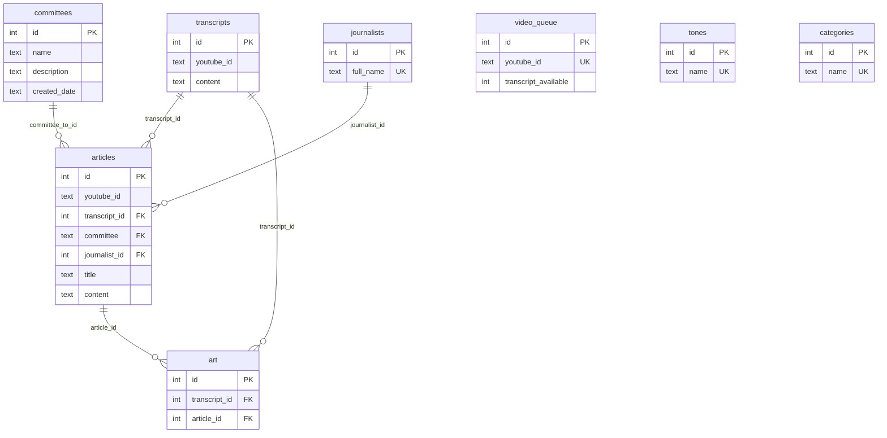

# What Can Delete Articles or Transcripts

Use this as a reference when investigating missing data (e.g. "250 articles and transcripts disappeared").

## Articles

| Cause | How | Bulk? |
|-------|-----|--------|
| **DELETE /article/{article_id}** | Single article (and its art rows). | No – one per request. |
| **DELETE /articles/remove-duplicate-per-transcript** | For each transcript that has more than one article, keeps the oldest article and **deletes the rest**. | Yes – one request can delete many articles. **Does not delete any transcripts.** |

There is **no** other code path that deletes articles. No bulk delete by date, no cascade from transcripts.

## Transcripts

| Cause | How | Bulk? |
|-------|-----|--------|
| **DELETE /transcript/delete/{transcript_id}** | Single transcript by ID. | No – one per request. |

There is **no** bulk delete of transcripts in this app. No endpoint and no internal code that runs `DELETE FROM transcripts` without a single `id = ?`.

## Schema

Schema is defined in [`app/data/create_database.py`](../app/data/create_database.py) (`Database._create_all_tables`). Relationships below match the declared SQLite foreign keys (none use `ON DELETE CASCADE`).

### Legend

**Column tags (inside each box)**

| Tag | Meaning |
|-----|---------|
| **PK** | **Primary key** — uniquely identifies one row in that table (e.g. `transcripts.id`). |
| **FK** | **Foreign key** — stores an id (or key value) pointing at another table’s PK, linking rows together. |
| **UK** | **Unique key** — duplicates not allowed for that column (same idea as PK for uniqueness, but not necessarily “the” row id). |

**What the `*_id` fields mean (not just jargon)**

| Column | Points at | In plain English |
|--------|-----------|------------------|
| **`transcripts.id`** (PK on `transcripts`) | — | The internal row id for **one saved transcript** (caption/text + metadata for a YouTube video). **`DELETE /transcript/delete/{transcript_id}`** is this value. |
| **`articles.transcript_id`** | `transcripts.id` | **Which meeting transcript this article came from** — the article is the write-up; the transcript is the source recording/captures. |
| **`articles.id`** (PK on `articles`) | — | The internal row id for **one news article**. **`DELETE /article/{article_id}`** is this value. |
| **`art.transcript_id`** | `transcripts.id` (optional) | **Art linked to that meeting/transcript**, independent of whether you like the article row. |
| **`art.article_id`** | `articles.id` (optional) | **Art linked to that specific article** (e.g. illustration for that published story). |
| **`articles.journalist_id`** | `journalists.id` | **Which journalist is credited** for that article. |
| **`articles.committee`** | `committees.id` | **Which committee** the article is filed under (stored in a quirky way in SQLite — see DDL quirks below). |

**Relationship lines (Mermaid)**

Symbols are read **from the parent / “one” side toward the child / “many” side**. On each end of the line: **`||`** means **exactly one**, **`o{`** means **zero or more** (optional many).

So a line shaped like **`Something ||--o{ SomethingElse`** means **one-to-many** from left to right: each row on the right (**child**) references **one** row on the left (**parent**); each parent may have **zero or many** children. Reading from the child table toward the parent, that is **many-to-one**.

**Relationships in this diagram**

| From → To | Cardinality | Plain language |
|-----------|-------------|----------------|
| `committees` → `articles` | One-to-many | Many articles under one committee; each article points to **one** committee row. |
| `journalists` → `articles` | One-to-many | Many articles by one journalist; each article points to **one** journalist. |
| `transcripts` → `articles` | One-to-many | Several articles can incorrectly point at the **same** source transcript until deduped; each article still means “I summarize **this** transcript row.” |
| `transcripts` → `art` | One-to-many | Several **images** can be associated with the **same** meeting transcript (`art.transcript_id`). |
| `articles` → `art` | One-to-many | Several **images** can be associated with the **same** article (`art.article_id`). |

Tables **`video_queue`**, **`tones`**, and **`categories`** appear for context; they have **no foreign-key edges** in this diagram (`video_queue` is only loosely tied by `youtube_id`, and tone/category names are copied as **text** onto `articles`, not FK links).

**DDL quirks**

- `articles.committee` is typed `TEXT` in SQLite DDL while referencing `committees(id)` (integer PK)—matches [`create_database.py`](../app/data/create_database.py) as deployed.
- The **`committees`** table is referenced by `articles` and populated via `add_committee`; confirm your DB actually has this table (older/manual DDL vs fresh `_create_all_tables`).

**How this relates to deletes**

- Foreign keys do **not** use `ON DELETE CASCADE`. Deleting an article does **not** delete its transcript (or the reverse). Deleting a transcript does **not** remove related articles; `articles.transcript_id` can become a dangling reference unless something else updates or deletes those rows.
- **`art`**: Not cascade-deleted by SQLite. The API deletes linked `art` rows **explicitly** when removing an article (`delete_art_by_article_id` before `delete_article_by_id`). Transcript-only deletes do not clear `art` in application code—check DB if you care about orphaned `art.transcript_id`.
- **`video_queue`**: Shares `youtube_id` with transcripts logically; there is **no** foreign key between `video_queue` and `transcripts`.
- **`tones` / `categories`**: Enum-synced lookup tables. Article tone/type are stored as **`TEXT` on `articles`**, not FK columns in the schema.

## If both articles and transcripts dropped together (e.g. 250 of each)

- **This app cannot do that.** It cannot bulk-delete transcripts, and the only bulk delete for articles (remove-duplicate-per-transcript) does not touch the `transcripts` table.
- Likely causes: **database file replaced or restored** (deploy, backup restore, wrong DB path, different server), or **external tool/script** (manual SQL, another service) that modified or replaced the DB.

## How to check after the fact

1. **app.log**  
   Search for:
   - `Removed duplicate articles` → remove-duplicate-per-transcript ran (deleted some articles only).
   - `Successfully deleted article` / `Successfully deleted transcript` → single deletes; count how many to see if it matches.

2. **Startup counts**  
   The app logs `Database counts at startup: transcripts=N, articles=N`. If you have log rotation or archives, compare before/after an incident.

3. **Who can call the API**  
   Check crontabs, GitHub Actions, scripts, or other services that might call `DELETE /article/{id}` or `DELETE /transcript/delete/{id}` or `DELETE /articles/remove-duplicate-per-transcript`.
