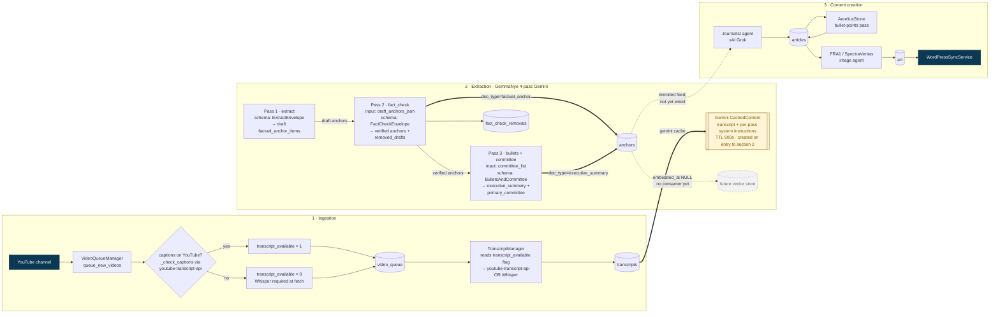
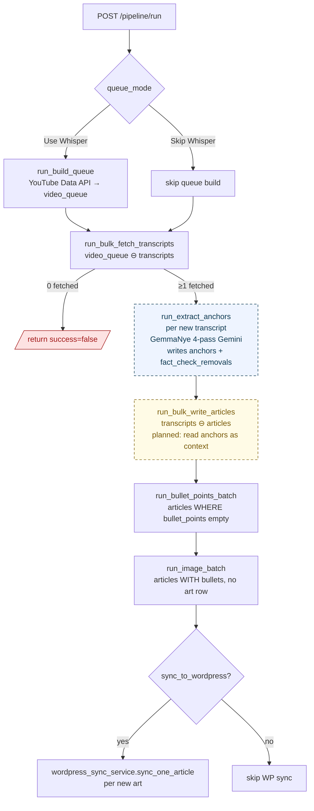
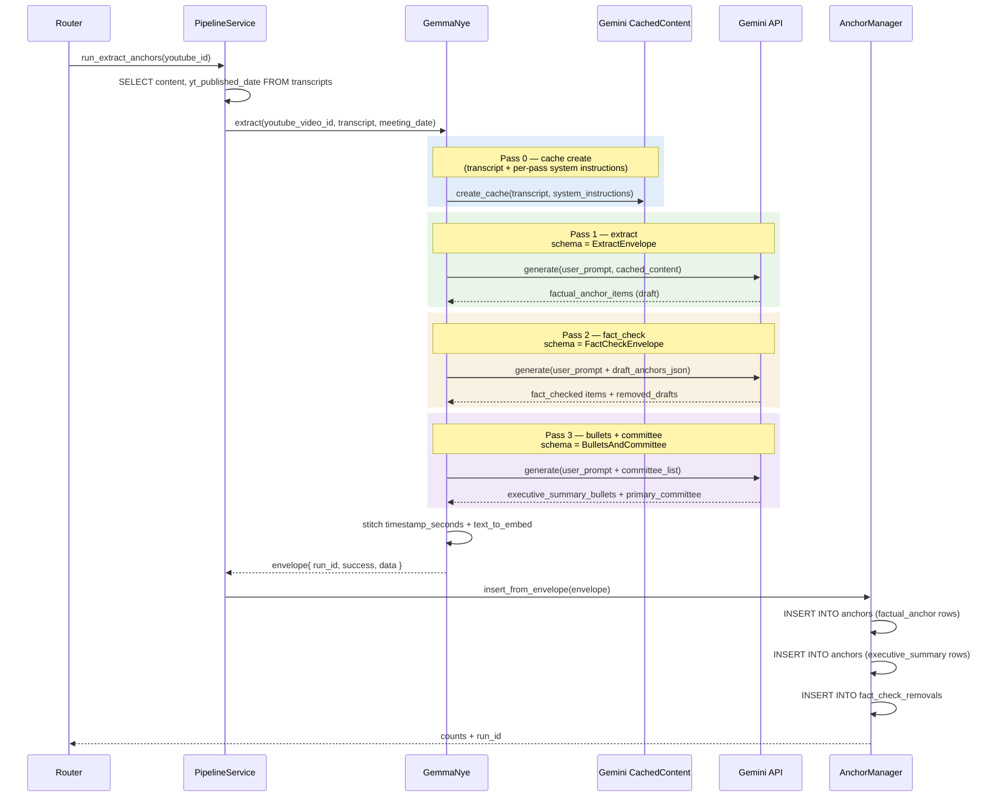
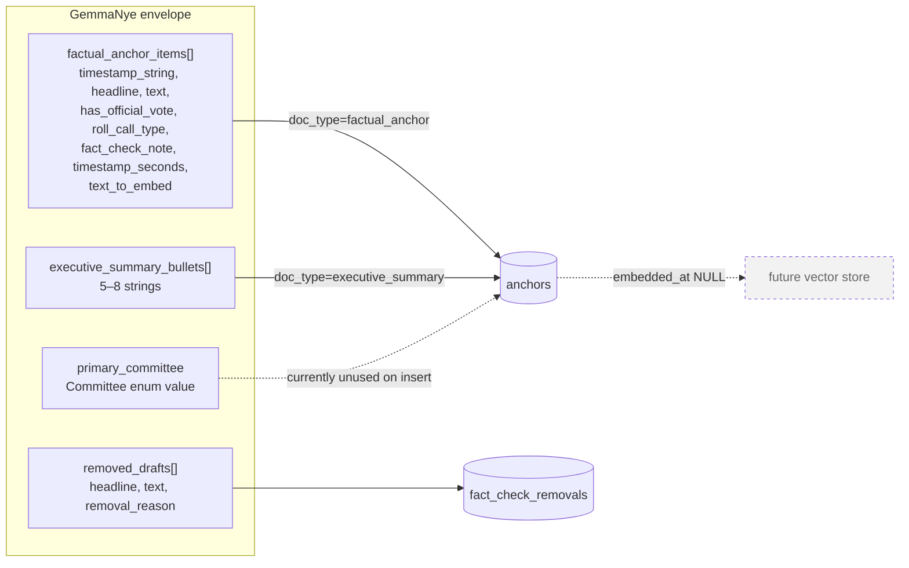

# Pipeline visualization

This document visualizes the Fall River Mirror content pipeline end-to-end, with a deep dive into how the **extraction pass** pulls in data and where its output lives.

The main pipeline runs as **three sequential sections** against a shared SQLite store:

1. **Ingestion** — discover videos and pull transcripts into the `transcripts` table.
2. **Extraction** — turn each transcript into structured "anchor" rows via GemmaNye (4-pass Gemini).
3. **Content creation** — journalists, bullet points, art, and WordPress publish, fed by extraction output.

Extraction sits **between** ingestion and content creation: it consumes the raw transcript and produces the structured grounding that downstream content agents are designed to read from. The wiring that auto-chains these three sections inside `POST /pipeline/run` is not complete in code yet — today extraction is invoked manually via `POST /extract/anchors/{youtube_id}` — see [§5 Open seams](#5-open-seams).

---

## 1. End-to-end map (main pipeline)



**Hard stop**: if `run_bulk_fetch_transcripts` returns zero new transcripts, `/pipeline/run` short-circuits before any article/image/WP work (`app/routers/pipeline.py` ~L193).

---

## 2. Main pipeline — sequencing and gates



**Legend.** Solid boxes = wired in `/pipeline/run` today. Dashed blue box = step in the intended sequence that exists as a route (`POST /extract/anchors/{youtube_id}`) but is not yet auto-invoked by `/pipeline/run`. Dashed yellow box = step that runs today but is **partially** complete — it executes, but does not yet consume the upstream `anchors` rows it's meant to be grounded in.

**No central status column.** Each stage's eligibility is a SQL anti-join on the next table. Progress is implicit in which tables hold which rows for a given `youtube_id`.

| Stage | "Ready when…" | Code |
| --- | --- | --- |
| Queue | YouTube ID not in `transcripts` | `app/services/pipeline_service.py` ~L268 |
| Transcript | row in `video_queue`, not in `transcripts` | `~L307` |
| **Extraction** *(planned auto-invoke)* | `transcripts.content` non-empty for `youtube_id`; no `anchors` row for this run | `~L949` |
| Article | `transcripts` LEFT JOIN `articles` WHERE `a.id IS NULL` | `~L550` |
| Bullets | `articles.bullet_points` empty/null | `~L698` |
| Art | bullets non-empty, no `art.article_id` | `~L780` |
| WP sync | article has content + bullets + art; not on WP | `app/services/wordpress_sync_service.py` ~L656 |

---

## 3. Extraction pass — how it pulls in data

The extraction pass is `PipelineService.run_extract_anchors()` (`app/services/pipeline_service.py` ~L864) dispatching to `GemmaNye.extract()` (`app/agent_kit/agents/extractors/gemma_nye.py`).

### 3a. Data sources consumed

```mermaid
flowchart LR
  subgraph inputs [Inputs read at extract time]
    direction TB
    REQ[Path param<br/>youtube_id]
    TRC[(transcripts)<br/>content, yt_published_date]
    ENUM[Committee enum<br/>app/data/enum_classes.py]
    SI[System instructions .md<br/>extract / fact_check / bullets]
    UP[User prompts .md<br/>extract / fact_check / bullets]
    BIO[Bio + description .md<br/>identity context]
  end

  subgraph agent [GemmaNye agent]
    LOAD[load_transcript_for_youtube_id<br/>pipeline_service ~L949]
    META[meeting_date =<br/>yt_published_date 0..10]
    PROMPT[render user prompts<br/>youtube_video_id, meeting_date,<br/>draft_anchors_json, committee_list]
    CACHE[Gemini CachedContent<br/>TTL 900s, base_extractor ~L428]
  end

  REQ --> LOAD --> META
  TRC --> LOAD
  LOAD --> CACHE
  SI --> CACHE
  UP --> PROMPT
  BIO --> CACHE
  ENUM --> PROMPT
  PROMPT --> CACHE
```

**Not consumed:** WordPress posts, crawled pages, prior `anchors` rows, article bodies, external URLs at runtime. The agent works only from the SQLite transcript plus the prompt scaffolding bundled in the repo.

### 3b. Four-pass Gemini choreography



Each pass writes a debug JSON to `logs/extractions/{ts}_yt{id}_r{run_id}_p{pass_label}.json` (`app/agent_kit/agents/extractors/base_extractor.py` ~L381). Re-extraction does **not** overwrite — it gets a fresh `run_id` UUID and appends.

### 3c. Output shape and persistence



**`anchors` columns written** (`app/data/anchor_manager.py` ~L147):
`youtube_id, run_id, doc_type, timestamp_string, timestamp_seconds, anchor_headline, anchor_text, has_official_vote, roll_call_type, fact_check_note, text_to_embed, extractor_name, model, created_at`.

**Placeholder, never populated yet:** `embedded_at`, `embedding_id` (`app/data/create_database.py` ~L292) — these signal a planned vector-store push that has no producer in `app/` today.

---

## 4. Data sources & sinks at a glance

| Stage | Reads | Writes |
| --- | --- | --- |
| Queue build | YouTube Data API, `transcripts` | `video_queue` |
| Transcript fetch | `video_queue`, YouTube captions / Whisper | `transcripts`; DELETE `video_queue` |
| Article write | `transcripts`, `articles`, `journalists` | `articles` |
| Bullet points | `articles` | `articles.bullet_points` |
| Image batch | `articles`, `art` | `art` (binary PNG) |
| WordPress sync | `articles`, `transcripts`, `art`, `journalists` | WordPress REST (external) |
| **Extraction** | `transcripts`, Committee enum, prompt `.md` | `anchors`, `fact_check_removals` |
| Editor spell-check | `articles` | `articles.spell_checked`, optional WP |
| Editor fact-check | `articles` | read-only report (no writes) |

---

## 5. Open seams

The three-section design above is the target; the code wiring is partially there. These are the gaps that turn the intended sequence into the current reality:

- **Extraction is not yet chained inside `/pipeline/run`.** The intended order is ingestion → extraction → content creation, but today `/pipeline/run` jumps straight from transcript fetch to article writing. Extraction has to be triggered separately via `POST /extract/anchors/{youtube_id}`. Wiring it in between `run_bulk_fetch_transcripts` and `run_bulk_write_articles` is the missing link.
- **Content creation does not yet read from `anchors`.** Journalists currently consume raw `transcripts.content` (`app/services/pipeline_service.py` ~L613). The whole point of extraction is to feed them structured, fact-checked anchors and an executive summary instead — that consumer is the next thing to build.
- **No embedder.** `anchors.embedded_at` / `embedding_id` exist on the schema but nothing writes them. The Typesense index in the WordPress theme covers published articles, not anchor-level RAG.
- **No status column on `transcripts` / `articles`.** Progress is inferred from anti-joins, so a failed stage shows up as "row not yet present in the next table." Useful to know when debugging stuck items.

---

## Files referenced

- Orchestration: `app/services/pipeline_service.py`, `app/routers/pipeline.py`, `app/routers/extractions.py`
- Extraction agent: `app/agent_kit/agents/extractors/gemma_nye.py`, `base_extractor.py`, `schemas.py`
- Extraction context: `app/agent_kit/agents/extractors/context_files/{system_instructions,user_prompts,bios,descriptions}/`
- Persistence: `app/data/anchor_manager.py`, `app/data/create_database.py`, `app/data/transcript_manager.py`
- Sync: `app/services/wordpress_sync_service.py`
