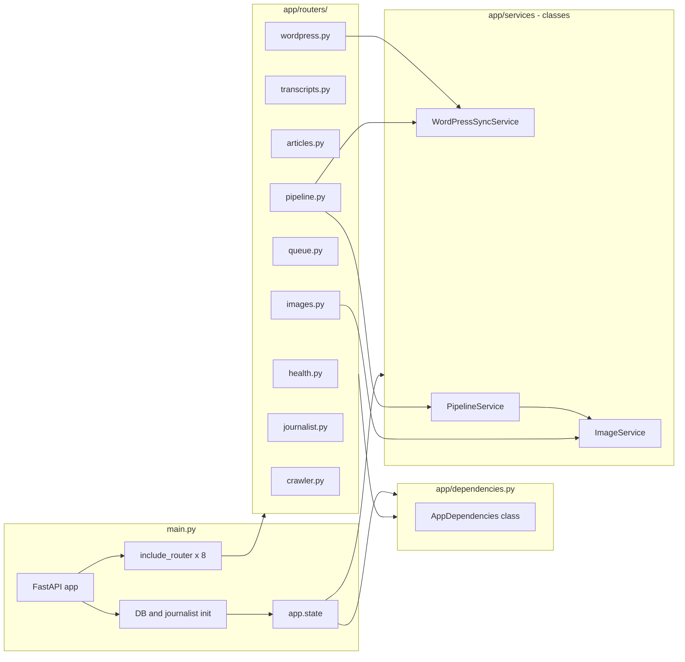

# Plan: Split main.py into routers

Short reference for when we implement the refactor. Generated from a codebase planning pass.

## Current state

- All ~35 API routes live in `app/main.py` (~3.3k lines).
- No `APIRouter` usage; everything is mounted on `app` directly.
- Harder to navigate, test, and change one area without touching the rest.

## Goal

Split routes by domain into separate router modules and keep `main.py` as a thin app factory + startup (DB init, journalist init, etc.).

## Target layout

## Suggested router breakdown

| Router / module        | Responsibility |
|------------------------|----------------|
| **Health**             | `GET /` (health check) |
| **Transcripts**        | `GET /transcript/fetch/{youtube_id}`, `DELETE /transcript/delete/{transcript_id}`, `POST /transcript/fetch/{amount}`, `GET /transcripts/without-articles` |
| **Articles**           | `GET /articles/`, `GET /articles/{article_id}`, `GET /articles/count`, `PUT /articles/{article_id}`, `PATCH /articles/{article_id}`, `DELETE /article/{article_id}`, `DELETE /articles/remove-duplicate-per-transcript`, `POST /articles/strip-h1-tags`, `POST /articles/strip-fall-river-from-titles`, article generation and manual create, `POST /article/write/{amount_of_articles}`, `PATCH /article/{article_id}/bullet-points`, `POST /bullet-points/generate/batch/{amount_of_articles}` |
| **Images / art**       | `POST /image/generate/...`, `GET /image/{art_id}`, `DELETE /image/delete/{art_id}`, `DELETE /art/delete-all`, `DELETE /art/cleanup-duplicates`, `PATCH /image/{art_id}/regenerate` |
| **Queue / pipeline**   | `POST /queue/build`, `POST /queue/cleanup`, `GET /queue/stats`, `DELETE /queue/clear`, `POST /pipeline/run`, `GET /transcripts/pending/{journalist}` |
| **WordPress sync**     | `POST /sync-article-to-wordpress/{article_id}`, `POST /sync-articles-to-wordpress`, `POST /sync-missing-articles-to-wordpress` |
| **Journalist**         | `GET /journalist/{journalist_name}` |
| **YouTube crawler**    | `GET /yt_crawler/{video_id}` |

## Implementation approach

1. Create `app/routers/` (e.g. `__init__.py` plus one file per domain or a few grouped files).
2. Move route handlers and their immediate helpers from `main.py` into the right router module. Pass shared dependencies (e.g. `database`, `transcript_manager`, `article_generator`) via router constructor or dependency injection.
3. In `main.py`, create each router and call `app.include_router(router, prefix="..." optional, tags=[...])`.
4. Keep in `main.py`: app creation, logging config, env/config, DB and journalist init, and any shared helpers used by multiple routers (or move those to a `app/utils` or `app/core` if they grow).
5. Run tests and manual smoke checks; fix imports and any broken references.

## Related (do later or in parallel)

- **Article storage**: Several article endpoints still use in-memory `articles_db`; migrating them to the SQLite `articles` table is a separate P0 item (see plan discussion in chat).
- **README**: After refactor, consider a short “Architecture” or “API structure” section pointing to `app/routers/` and `main.py`.

---

*Pick up from here when ready.*
